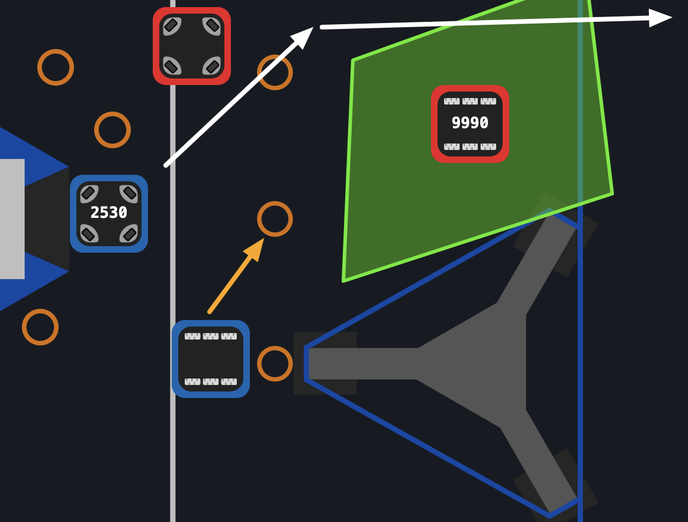
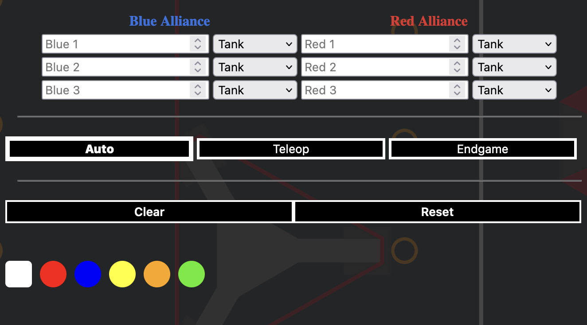

# Game Planner 

  
This is the repository for Game Planner, designed for use by FRC teams for game related strategy. 

It functions in the browser, and can either be run by downloading the code from the current year branch, and running locally, or by visiting [the online version](https://netlockj.github.io/frc-game-planner/).

---

  
The background is from PathPlanner, please check out the awesome tool [here](https://github.com/mjansen4857/pathplanner)!

Good Luck to all FRC teams!

## Tools

---

- Cursor : used to drag elements around on the field
- Eraser : used to erase elements placed on the field
- Pen : used for freehand drawing
- Arrow : used for directional drawing, press for initial arrow point, and drag/release to finish drawing arrow
- Gamepiece : used to place a gamepiece on the field
- Zone : used to mark a transparent polygon on the field to highlight an area on the field
- Robot : used to place a robot on the field

## Settings

- Team numbers, and drivetrain types (will carry through game stages)
- Switching between Auto, Teleoperated and Endgame, each will start as a blank canvas, which can be modified, and returned to later
- Clear will clear the current selected game stage mode (If in Auto, Auto will be cleared)
- Reset will completely reset everything than can be changed and will clear all game stage fields
- Colors will change the color of the pen, arrows, and zone polygons
- Save/Load currently do nothing, just there for whenever support gets added for them

# Version 2.1.0 changes
- TBA support for autofilling matches
- Style changes and various improvments

## In the works
- Saving/Loading Files
